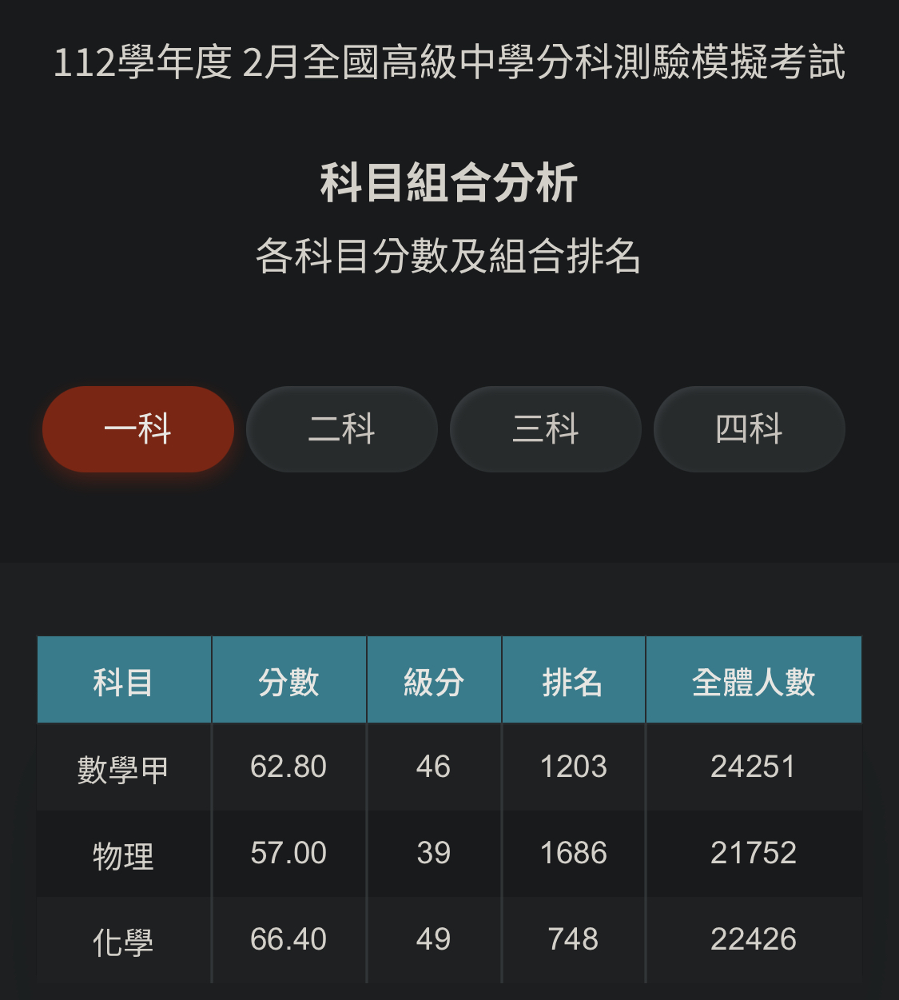

# 序

這篇文章或許一兩年前就該出來了。考完分科後我就一直想寫，~~但一直有點懶~~，加上當時也沒有合適的平台，就這樣拖到了現在。

準備分科之前，我是個沒什麼主見的人——老師讓我背我就背，讓我抄筆記我就抄。但準備學測的過程讓我踩了不少坑，發現許多老師的方法根本不適合我，白白浪費了很多時間。所以在準備分科期間，我開始頻繁審視、調整自己的讀書方式。這篇文章整理的，就是我備考當時以及大學這兩年持續琢磨出來的一些想法。

之後對於筆記&錯題本、數甲、物理、化學都會分別寫一篇，~~但完成時間就隨緣了~~ ，這學期真的好忙

---
# 關於我你需要知道的
## 我的成績

113 學測：
> 國文 13 級分\
> 英文 15 級分\
> 數學 13 級分\
> 自然 15 級分

113 分科：
> 數甲 59 級分\
> 物理 60 級分\
> 化學 60 級分

## 我在準備分科前的程度

這是我第一次模考的分數

嗯\
就如你所見，當時我基本處於「有印象，但不多」的狀態。加上我之前沒有寫筆記的習慣，所以從二月起，我決定從頭完整讀過一遍分科範圍，並同步整理出一套筆記。

## 沒打過競賽：（

高中的競賽我算是隨緣打，有名額就去，也沒特別準備，最好的成績也就佳作而已：（\
說真的，到現在還是很後悔沒有認真準備競賽。如果你現在是高一高二、還有餘裕的話，真的可以去找一些課外的事做，不一定要是競賽，但不要把眼光全放在學業上。

> 雖然我高中三年把重心放在看小說上就是了（Ｘ\
> 真的很後悔

---
# 時間規劃
## 備考期間我完成了什麼？

1. 重讀了分科範圍
2. 對整個分科範圍做了一套筆記
3. 刷了我猜大約 50 ~ 70 份歷屆模考以及 103 到 112 的分科歷屆試題
4. 做錯題本

## 二月到七月我是如何規劃的？

還沒讀完考試範圍就去寫考卷，對我來說總感覺哪裡怪怪的，所以我選擇先完整讀完全部範圍，再開始刷模考和歷屆試題。（也因此三次模考我沒有一次平均高於 50 級分——第三次模考結束前，我其實都還沒讀完整個範圍。）

下面是粗略的時間規劃：
- 二月中到五月中：重讀分科範圍並且做筆記
- 五月中到考試前：每天一直刷模考、檢討並且做錯題本

> 在二月中到五月中我的重心完全放在理解概念以及做筆記上面，沒有寫任何一份考古，只專心在一件事上就是把我所有的疑惑都解開

## 我的每週作息
### 平日

| 時間   | 從八點開始讀到晚上九點，中餐晚餐分別休息一個小時左右 |
| ---- | -------------------------- |
| 做什麼事 | 讀新的進度、刷模考和歷屆               |

### 假日

| 時間   | 每天讀小於五小時                    |
| ---- | --------------------------- |
| 做什麼事 | 複習這週讀的範圍、重看這週錯的題目、規劃下週進度、舒壓 |

> 我覺得維持良好的身心狀況有助於思考

## 先唸完範圍再寫模考，還是同時進行？
### 先唸完再寫模考

我自己的方法是先完整讀完全部內容才開始刷考題，這樣做的好處是：
1. 可以最大化利用考題資源
2. 知識是連貫的而非透過考卷碎片化的進來
3. 全部讀完後開始寫考卷進步速度會很快

> 大概開始刷了十份模考後開始可以穩定在 50 級分以上

但壞處是：\
4. 沒辦法利用好正式模考（因為還沒讀完考試範圍）\
5. 需要嚴謹的時間規劃（不然可能考卷沒刷完正式考試就到了）

> 所以週末很大的作用就是將平日欠下沒讀完的進度補完

### 一邊刷題一邊讀（朋友的方法）

這是我一個朋友的方法：還沒讀完分科範圍就開始刷考卷，透過題目中碎片化的知識慢慢拼湊出全貌。我自己沒試過這種方式，不好評價，但在 LLM 已經如此強大的現在，我覺得這個方法或許是個不錯的選擇——遇到不懂的地方直接問 AI，效率可能比翻講義更高。

> 最後這個朋友進入了台大醫，所以兩種方法其實沒有誰好誰壞，就看個人偏好

---
# 準備分科期間用過的資源
## 講義簡評
### 數學

| 講義          | 敘述                                              |
| ----------- | ----------------------------------------------- |
| 關鍵 60 天     | 題目程度是有，用於確認自己有沒有忘掉什麼東西挺不錯的，但不要真的花六十天寫，十幾二十天差不多了 |
| 對話式         | 好書，題型夠多也不會太難，比關鍵 60 天還推                         |
| 徐氏 (108 課綱) | 很爛，完全不推，題目非常爛                                   |

### 物理

| 講義     | 敘述                              |
| ------ | ------------------------------- |
| 我的老師講義 | 推爛，這也是為什麼下面講義評價比較低，因為老師的講義太好了（Ｘ |
| 新大滿貫   | 難度過低，不推薦                        |
| 周衝刺    | 記憶有點模糊，但學校買了我就寫了，但沒啥難度，不推       |

### 化學

| 講義   | 敘述                                                                                                                        |
| ---- | ------------------------------------------------------------------------------------------------------------------------- |
| 引航單冊 | 我複習化學的方式就是引航全套從頭開始寫——觀念寫得很清楚完整、題目難度較分科低、適合從頭複習使用，之後透過模考歷屆適應正式考試題型難度                                                       |
| 九陰真經 | 1. 跟時代脫節其中許多知識在分科都不會遇到 2. 內容公式有許多錯誤不知道是不是故意不修 3. 我分科期間僅讀了這本書的有機和無機章節，這兩個章節需要大量背誦所以九陰真經這種太過完整的講義剛好（但我在高一二曾經讀過它的其他章節） |
| 周衝刺  | 同物理                                                                                                                       |

> 之後或許會有比較詳細的但或許我會懶得寫而且也忘得有點多

## 歷屆模考是你最重要的資源

我很常看到有人問：「有沒有什麼複習講義出題出的和正式考試很像？」\
我對此的回答就是刷模考吧

北模、中模各種模每年都會產生好幾套試卷，這些題目的目的就是模擬正式考試，並且要供給給數萬考生使用，題目品質還算是有保障。

講義對我來說只是學習分科內容的工具。從五月中讀完考試範圍後，我沒有再買任何講義，而是把全部精力放在刷模考和歷屆上。

> 除了中模，它就是用來折磨人的

## 我沒補過習：）

我唯二補過的習是小學補英文以及小四到小六補數學，之後就沒有再去過補習班了

> 當然也跟我在國高中都遇到了很棒的老師有關，我到現在還是很感謝他們

---
# 心態調整
## 我考分科時的心態

從五月開始，我每天的生活就非常固定：起床洗漱，然後開始刷模考、檢討錯題，一天大概能刷三到五份。日復一日的節奏，讓我逐漸進入一種對外部干擾幾乎無感的狀態。

所以當我到正式考場時，我居然沒有緊張！到現在我還是覺得很神奇
考試當下的心態就跟刷模考一樣，用一樣的策略、一樣的思維、一樣的檢查方式，按部就班地將考卷寫完

> 但這不是說我正式考試不會緊張，考學測的時候數 A 緊張到一直冒手汗最後直接把自己送到分科

## 我怎麼做到的
### 規律的生活

從五月開始我每天的行程都非常固定，早起刷模考、午覺睡完刷模考、吃完晚餐刷模考，模考的形式和正式考試一模一樣，所以某種程度上我在正式考試前已經模擬了數十次的考試流程

### 吃巧克力

在備考期間我看到了一篇文章說：「運動員在比賽前都會有一個自己習慣的動作幫助自己緩解緊張。」\
所以我就嘗試在每次寫模考前都吃一塊巧克力，讓甜蜜的滋味充滿我的味蕾\
或許這個方法有幫助？又或者沒有？其實我也不知道

### 信心

我將所有的歷屆試題留到考前兩週才寫，因為我認為這些歷屆試題是最寶貴的資源。為了讓我有最真實的正式考試模擬，之前寫講義時對於所有歷屆試題我都直接跳過不做，並且在那兩週我都嚴格按照正式考試時程走

在這兩週中，我寫的所有歷屆除了 111 年和 112 年的數甲壓在 60 級分線上外，其他考卷都遠高於 60 級分線，這或許給了我自己很大的信心

### 完全標準化的做題策略

「要以什麼順序寫題目？哪些題目要跳過？看到某個範圍的題目我該優先考慮哪些解法？要避免哪些陷阱？」

我把升大學考試比做一場 Overfitting 大賽。我不需要成為天才，也不寄望考試當下的靈光一閃，而是將所有流程標準化——把寫過的題目分門別類，為每個主題、每種題型訂定固定的解題流程。如此一來，就算上場時緊張，只要記得自己定下的標準工序，就能本能地跟著流程走完考卷，最大程度地排除外部因素的干擾。

例如：看到空間中的兩條線要先確定是重合、平行、相交還是歪斜。如果是歪斜又有哪幾種題目？要怎麼最快速的求出兩歪斜線的最短距離？要怎麼求出最短距離那條線的方程式？這條線和原本歪斜的兩條線交點要怎麼求出？

> Overfitting 指的是機器學習模型在在訓練集上表現得很好，但在實際使用時表現得並不好的情況，對應到現在討論的場景就是我們不用去想以後要怎麼運用這些分科的知識，只需要想辦法去 Overfit 分科測驗這個訓練集就好了

# 你該做什麼，不該做什麼
## 你該做什麼
### 寫筆記、錯題本

要做這兩件事我想到最主要的兩個原因：
1. 除非你是超級天才，不然橫跨數個月的備考一定會讓你忘東忘西
2. 雖然有將近半年可以準備，但其實對於完全重讀的我來說還是很緊湊。因此我那段期間的備考哲學就是我看過、寫過筆記的講義就可以丟掉，我寫完、檢討過的考卷就可以進回收桶。我絕不把時間浪費在同樣一份文件上兩次

但這一切都是為了效率，所以你該思考的是：如何用最短的時間做出最有效的筆記以及錯題本——不用任何美編或任何多餘的文字，只有那些你需要知道的知識才會出現在上面

> 之後會有一篇專門講這個，這個之後是多之後就先不討論了（Ｘ

### 做真正的訂正

訂正並不是只是將詳解或是算式抄下來就好，重要的是要理解為什麼要用這個式子、爲什麼能用這個定理，所以你不只要翻詳解，還要回去看看講義或問問 AI

> 這本來要放在筆記 & 錯題本那，但我不知道我會不會懶得寫下一篇，所以在這裡先簡單說一下好了

### 保持良好作息

我在大學對此感受更深，每天睡足七八小時是真的可以讓思考的速度以及準確度提升好幾個檔次。熬夜讀書不是時間分配不合理，就是用這個來催眠自己已經很認真了，就算最後失敗也盡力了，但你只是盡力讀書，沒有去想怎麼讀的更有效率、讀的更深、記得更牢。

### 找一些不太耗時間的小興趣

壓力也會讓人崩潰，也會嚴重影響身心狀況，尋找一些不太消耗時間的小興趣，從中找到快樂，可以支持你度過這數個月的高壓，並且這個興趣最好有明確的時間斷點避免你沈迷進去

像是聽音樂、魔術方塊、運動、曬太陽...

> 不要看小說，我用自身經驗告訴你你會不小心沈迷進去

### 和同學討論

遇到難題或解得很慢的題目時去找程度相當的同學討論，每個人不斷提出新的想法、抓出他人想法的漏洞，可以很快地幫助你們進步，因為這個過程你在將原本只會用來解題的知識用來反駁他人提出的解法，這需要對於那些知識概念更深的理解。

### 善用工具 (AI)

研究 AI 工具是我現在的興趣之一。回頭想想，如果備考時就有這些工具，我應該可以把原本花三個月重讀範圍的時間壓縮到一個半月。

下面是一些我覺得不錯的工具，可以按自己需求去查詢使用：

| 工具                    | 評價                                                                              |
| --------------------- | ------------------------------------------------------------------------------- |
| Claude Sonnet 4.6     | 對於解釋概念的能力遠高於 Gemini, ChatGPT, Deepseek 等，並且現在可以快速產生 Flowchart 和 Diagram 之類的解釋概念 |
| Gemini 3 Thinking/Pro | 對於數學物理解題非常強                                                                     |
| NotebookLM            | 如果有數十數百頁的講義請使用 NotebookLM，正常模型會因為使用 RAG 技術產生幻覺                                  |

> 雖然有很多其他人做的專門給學習專用的產品，但我到目前為止覺得這三個就夠了，而且 Gemini 之前有送一年訂閱實在太香了（Ｘ

## 你不該做什麼
### 認為任何休閒都是浪費時間

壓力絕對會壓垮你，所以你必須花時間休息，將一段時間累積的壓力快速消耗，才能繼續維持清醒的頭腦

### 認為死命讀書能考好

花很多時間努力讀書很好，但你有去記錄自己忘掉了哪些知識？錯在哪些地方嗎？\
為什麼這個地方你背不起來？為什麼你會在這裡跳入陷阱？\
我做的錯題本，真的有助於我不在同一個地方踩第二次坑嗎？\
我現在做的筆記夠清楚嗎？是不是有可以優化的地方？\
我考試會緊張該怎麼辦？

怎麼讀書，本身就是值得認真思考的問題。如果你能優化流程，讓你用半小時做完原本需要一小時的事，這比埋頭苦讀有用得多。

### 認為背題是有效果的

我做題目雖然有標準流程，但不是靠背題的。我做的是把考題內容抽象成一個個概念，再去理解這些概念如何互相串聯、導出正確答案。

背題沒有用並且浪費時間，沒有人會指望正式考試會出現一模一樣的考題（除了化學），我寫了六七十組考卷四五千題，你的記憶力有這麼好嗎？能背這麼多題目嗎？反正我是不行。

唯有真正理解——將知識抽象成概念，再將概念彼此連結成網，形成自己的認知框架——才能在千變萬化的題目中持續找出正解。

---
# 給家長的話
## 序

沒有考生是不想考好的。如果真的有，或者說他擺爛了，你也沒辦法強迫一個人認真為自己的未來負責，~~只能誘之以利~~。所以家長能做的，總結成一句話：讓考生保持良好的身心狀況，不要給他們額外的壓力，並且提供他們需要的資源。

## 備考期間不是不能有娛樂

備考會有很重的壓力，特別是對於那些自我期許很高的人。有可能有些考生給自己太大的壓力完全放棄所有娛樂，但這是不健康的，壓力持續累積會讓人腦袋遲鈍、睡眠變差，反而越讀越沒效率。

如果考生打了一下遊戲、聽了點音樂、滑了一下社群媒體，他或許正在釋放壓力。請不要打擾他，讓他好好休息。

## 不要質疑他做的努力與選擇

合格的考生會自己去理解考試制度、理解怎麼準備考試，家長與考生的年代已經相去久遠，如果你不能保證你對他做法的質疑還有你認為他應該做的事是符合這個時代的，那就請不要提出意見，讓他按著自己的步調前進

> 當然如果他自己表現出需要一些幫助，不管是什麼方面的，問問他吧

## 不要拿他和其他考生比較

不解釋，懂的都懂

# 小結：我現在對升學制度的想法
## 為什麼有這個部分？

國高中時期，身邊的老師和長輩不斷灌輸我一個觀念：考上台大、考上醫學系，是一個學生所能達到的最高成就。在這種思想的影響下，我一度無法接受學測成績不夠好、只能轉而走向分科這件事。雖然最終我得到了一個正面的結局，但進入大學這兩年，我仍持續在思考：升學制度的合理性、學歷的真正重量，以及現在的教育方式，究竟能不能教出一個「完整的人」。

這裡只是稍作抒發，等想法更完整了，我可能會另外寫一篇更長的文章來談這些。你或許會認同，也或許覺得我只是站在高處往下評判——但反正你愛看就看，不愛看就關掉吧（Ｘ

## 我在大學看到的

升大學考試篩選的，說穿了只有一件事：**在有限的時間內進行大量思考的能力**，也就是某種形式的邏輯與計算能力。

但它沒有篩選的東西更多——領導能力、研究能力、規劃活動的能力、協調事務的能力、與人互動的能力。這些能力在現實世界裡和學科能力同樣重要，甚至更重要，只是它們沒辦法被客觀量化，所以大考中心就乾脆不管了。

這也就是為什麼學歷和能力其實沒有很強的相關性。分數高的人或許有更大的機率同時擁有這些能力，但那也只是機率而已，不是保證。

所以，大考沒考好，並不代表你的能力被否定了。很可能只是大考中心沒有辦法測出你真正擅長的那些東西。

> 當然，台灣很多公司還是很愛看學歷，這是無可辯駁的事實：（

然後是讓我最有感觸的部分：進了大學之後，我才意識到上面說的那些能力，**我一個都沒有**。

高中三年，我很想說我把所有時間都花在讀書上，結果才沒有培養這些能力——~~但並沒有，都在看小說~~。大學讓我看見了自己在這方面完完全全是個新手，只能硬著頭皮一件一件去嘗試、去學。

國中、高中、大學、出社會，試錯的成本是逐步遞增的。而從大學到進入社會這個跨度，我相信成本會直接跳一個量級。所以，**趁學校還把所有人鎖在同一個環境裡，盡可能讓自己成長吧**。出了這個環境，代價就不只是後悔了。

現在想想，高中沒有認真做課外的事、沒有好好累積這些能力，大概才是我真正後悔的地方。
